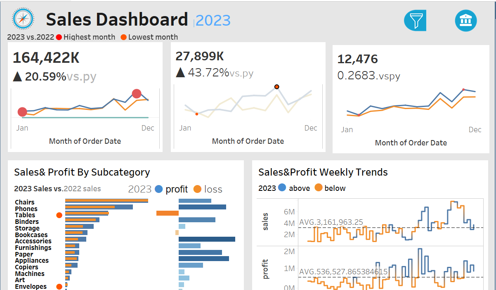
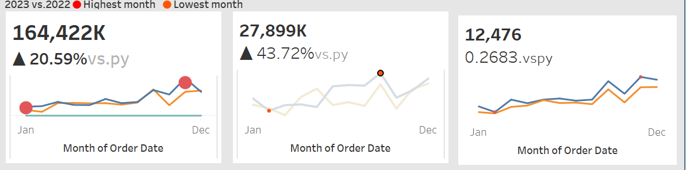
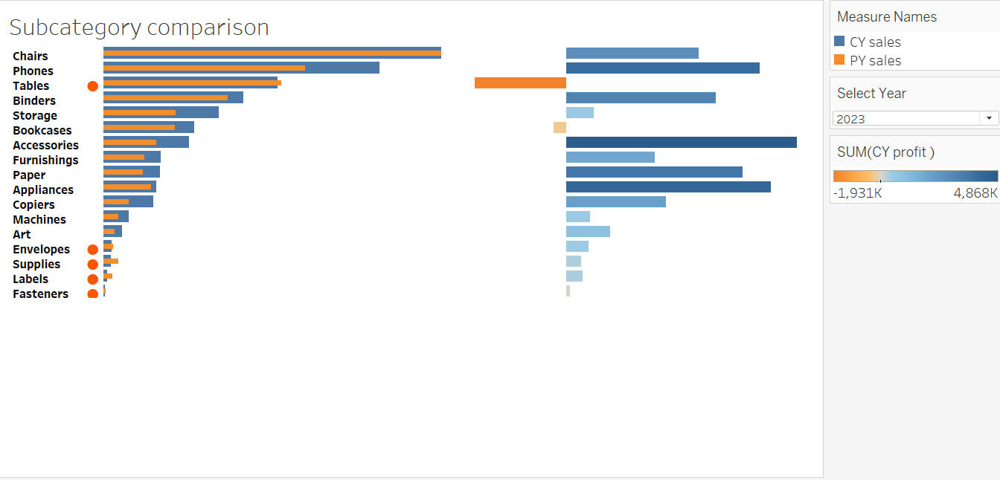

# Sales Analysis Project

## Overview

This project provides an in-depth analysis of sales data, focusing on key metrics such as total sales, profit, and quantity sold. The analysis also examines trends over time and highlights performance across different product subcategories.

## Key Visualizations

### 1. Dashboard

The main dashboard provides a comprehensive overview of the sales performance, summarizing key metrics at a glance.



### 2. Sales, Profit, and Quantity Graph

This graph illustrates the relationship between sales, profit, and quantity sold, helping to identify trends and correlations.



### 3. Weekly Trend Graph

The weekly trend graph shows how sales and other key metrics have fluctuated over time, allowing for the identification of patterns and seasonal trends.


### 4. Product Subcategory Graph

This graph breaks down performance by product subcategory, highlighting which products are driving sales and which may need further attention.



## View the Full Project on Tableau Public

You can view the entire project and interact with the dashboards on my Tableau Public profile:

[View the Sales Analysis Project on Tableau Public](https://public.tableau.com/app/profile/sharon.ndubai/viz/Book1_17198959442160/Dashboard1?publish=yes)

## How to Use This Project

1. **Clone the Repository:**
   - Clone this repository to your local machine using the following command:
     ```bash
     git clone https://github.com/username/sales-analysis.git
     ```

2. **Open the Project:**
   - Open the project in your preferred data visualization tool (e.g., Tableau, Power BI) to explore the dashboards and graphs interactively.

3. **Explore the Data:**
   - Dive into the visualizations to gain insights into sales performance, identify trends, and make data-driven decisions.

## Conclusion

This Sales Analysis project provides valuable insights that can help optimize sales strategies and improve overall business performance. Feel free to explore the dashboards and share any feedback.

---

### Contact

If you have any questions or feedback, please feel free to reach out to me at [sharonjeremy54@gmail.com](mailto:sharonjeremy54@gmail.com).